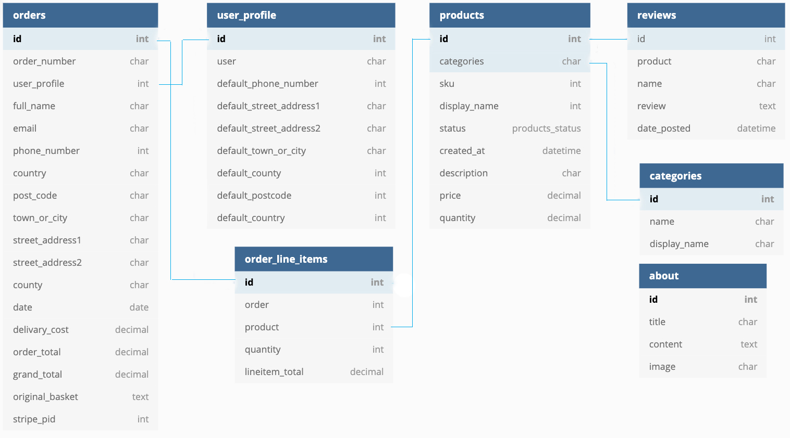

<div align="center">

# **TIPPLES - E-commerce MILESTONE 4 PROJECT**


An e-commerce site for a Independant alocohol store.

Live site available at [TIPPLES](https://pf-tipples.herokuapp.com/)
</div>

- This project aims to build a full-stack web application using Django full-stack web framework, HTML, CSS and JavaScript.

  - I have built an e-commerce store for a fictional Independant Alocohol Shop.
  
  - This application features e-commerce functionality, payments using stripe, a review section, user login via email, confirmation emails for purchases, CRUD functionality for admin to add products.

  - This website is for educational purposes and the stripe functionality is set up to accept the test card details please don't enter your personal card details. 
  
     - To use the stripe function use the following details.

        - card number : 4242 4242 4242 4242
        - Any date
        - Any CVV number.


## **Table of Contents:**

- [Site Owner Goals](#site-owner-goals)
- [User Experience (UX)](#user-experience-ux)
  - [User Stories](#user-stories)
  - [Design](#Design)
    - [Imagery](#imagery)
    - [Layout](#layout)
        - [Accessible to all users via the navbar](#Accessible-to-all-users-via-the-navbar)
        - [Accessible to logged in regisered users via the Navbar](#Accessible-to-logged-in-regisered-users-via-the-Navbar)
        - [Accessible only to Superusers(Admin) via the navbar](#Accessible-only-to-Superusers(Admin)-via-the-navbar)
        - [Accessible to all users via the Footer](#Accessible-to-all-users-via-the-Footer)
        - [Accessible to all users on the Products page](#Accessible-to-all-users-on-the-Products-page)
        - [Accessible to Superusers(Admin) on the Products page](#Accessible-to-Superusers(Admin)-on-the-Products-page)
        - [Accessible to Superusers(Admin) on the Product Detail page](#Accessible-to-Superusers(Admin)-on-the-Product-Detail-page)
        - [Accessible to Superusers(Admin) on the reviews page](#Accessible-to-Superusers(Admin)-on-the-reviews-page)
        - [Error Pages](#Error-Pages)
    - [Wireframes](#wireframes)
  - [Features](#features)
    - [Interactive Features](#Interactive-Features)
    - [Future Features](#future-features)
- [Technologies Used](#technologies-used)
  - [Languages Used](#languages-used)
  - [Frameworks, Libraries and Other Sources Used](#frameworks,-libraries-and-other-sources-used)
- [Information Architecture](#information-architecture)
    - [Database Choice](#database-choice)
    - [Data Modeling](#Data-Modeling)
- [Testing](#testing)
- [Deployment](#deployment)
  - [Heroku Deployment with AWS](#github-pages)
  - [Amazon Web Services](#forking-the-repository)
  - [Making A Local Clone](#making-a-local-clone)
- [Credits](#credits)

# UX:

## Site Owner Goals:

The tipples website is a real world application, designed for the selling of fitness and health suppliment products.

1. The site owner's primary goal is to sell their products to new and returning customers.
2. The secondary goal is to showcase new products that are available to new and returning customers. 

## User Stories:

- Customers
  - Website experience
    - As a customer, I would like to see what the website is selling.
    - As a customer, I would like to be able to navigate the website easily.
    - As a customer, I would like to see some information about the company.
    - As a customer, I would like to be able to contact the company.
  
  - Searching for items.
    - As a customer, I would like to see all the products the company sells.
    - As a customer, I would like to be able to search by category.
    - As a customer, I would like to be able to search through the items.
    - As a customer, I would like to sort the items by price.

  - Shopping.
    - As a customer, I would like to see the product price and description.
    - As a customer, I would like to be able to add products to my shopping cart.
    - As a customer, I would like to be notified when I complete interactions with the site.
    - As a customer, I would like to be able to edit my shopping cart.
    - As a customer, I would like to be able to checkout easily.
    - As a customer, I would like to receive confirmation of my order.

  - Account.
    - As a customer, I would like to save my details to an account.
    - As a customer, I would like to see my previous order details.
    - As a customer, I would like to leave a review of the company.

- Website owner.
  - As the business owner, I would like to be able to edit and add products easily.
  - As the business owner, I would like to be able to delete products.
  - As the business owner, I would like to have access to an admin section. 
  - As the business owner, I would like my customers to be able to shop on the site easily.

## Design:

### Imagery:

- On the landing page, the Hero image represents 'tipples' in the name of the company. The image is to indicate choice and selection of drinks which is the reason for a well stock cocktail bar. It was downloaded from [UnSplash](https://unsplash.com/)


- The origin of all other images is detailed in the [Credits](#Credits) section,


### Layout: 

#### Accessible to all users via the navbar:

- All Pages:
- **About** dropdown with the following options:
    - **About**:  Biography/marketing info for the company.
    - **Contact**: Contact the business owner via a contact form.
- **My Account**: 
    - **Login**: Login for existing users.
    - **Register**: Register as a user.
- **Shopping cart**:
    - **Shopping cart Icon**: Click here to navigate to the shopping cart page.
- **Search**: Search the site using key words.
- **All Products** dropdown with the following options:
    - **By Price**: Display items by price.
    - **By Ratings**: Display items by ratings.
    - **By Categories**: Display items by categories.
    - **All Products**: Display all products.
- **Bar Equipment** dropdown with the following product options:
    - **Glasses**: Show a selection of glasses.
    - **Equipment**: Show a selection of bar equipment.
    - **All Equipment**: Shows all bar equipment.
- **Drinks** dropdown with the following options:
    - **Vodka**: Show all vodka products.
    - **Gin**: Show all gin products.
    - **Rum**: Show all rum products.
    - **Whisky**: Show all whisky products.
    - **Craft Beers**: Show all craft beer products.
    - **Tequila**: Show all tequila products.


#### Accessible to logged in regisered users via the Navbar:

-**My Account**:
    - **My Profile**: Navigate to the session user's profile page.
    - **Logout**: Log out of the site.

#### Accessible only to Superusers(Admin) via the navbar:

-**Product Management**: Add products to the site.

#### Accessible to all users via the Footer:

- **Social Media** links to the following social media sites:
    - **Facebook**
    - **Twitter**
    - **Instagram**
    - **Youtube**
- **Email**: Icon Link to available for contact business owner.

#### Accessible to all users on the Products page:

-**Sort Box**: Allows the user to sort the items by price, rating, name and category.

#### Accessible to Superusers(Admin) on the Products page:

-**Edit**: Allows a superuser to edit a product.
-**Delete**: ALlows a superuser to delete a product.

#### Accessible to Superusers(Admin) on the Product Detail page:

-**Edit**: Allows a superuser to edit a product.
-**Delete**: Allows a superuser to delete a product.

#### Accessible to Superusers(Admin) on the Reviews page:

-**Delete**: Allows a superuser to delete a review by user.

### Error Pages:

-**404 Error Page**: A custom 404 error pageto redirect users back to the site in the event of a 404 error.

-**500 Error Page**: A custom 503 error pageto redirect users back to the site in the event of a 500 error.

-**403 Error Page**: A custom 505 error page to redirect users back to the site in the event of a 403 error.


### Wireframes:

Are available in pdf [here](readme/wireframes/wireframe-pdf.pdf)

### Features:

#### Interactive Features:

The Tipples website has been built around the principles of CRUD (Create, Read, Update, Delete), meaning these actions are all avaliable:

- **Register**: The site visitor can add their details to open an account on the site.
- **Login**: The site visitor can login to the site if they are an existing user.
- **Contact**: Any User can contact the site owner by email.
- **Sort**: Any user can sort the products by price, name or category.
- **Search**: Any user can search the site using keywords.
- **Checkout**: Any user can make a secure purchase using Stripe.
- **Add Product**: The superuser (Admin) can add products to the database.
- **Edit Product**: The superuser (Admin) can edit products that are already in the database.
- **Delete Product**: The superuser (Admin) can delete products that are already in the database.
- **Add Review**: A logged in and registered user can add a review.
- **Delete Review**: The superuser (Admin) can delete a review.

#### Future Features:

In future I would like to add the following features:

- **Wishlist**: I would like users to be able to create a wishlist.
- **Delivery Address**: I would like users to be able to specify different billing and delivery addresses.
- **Paypal**: I would like users to be able to pay for their items using Paypal.
- **Subscription**: pay monthly subscription service.

## Technologies used:

- The application was built on the Django full-stack framework.
- For each section of the site a Django app was created.
- Each app then has a views.py, urls.py file to create the pages it needs.
- Then to create the database models a models.py file is used.
- If there are any forms needed they are then created in the forms.py file.
- Stripe has been used for the payment function of the e-commerce shop.
- Heroku was used to deploy the application.
- Amazon AWS was used to store. the static files and the image files.

### Languages Used.

- [HTML5](https://en.wikipedia.org/wiki/HTML5)

  - HTML5 was used to create the content and base of each page.

- [CSS3](https://en.wikipedia.org/wiki/CSS)

  - CSS3 was used to then style the page and make it responsive through media queries, and interactive through using CSS transitions.

- [JavaScript](https://en.wikipedia.org/wiki/JavaScript)
  - javaScript was used throughout the website to make the site interactive.

- [Python](https://en.wikipedia.org/wiki/Python_(programming_language))
  - Python was used to build the backend functionality of the web app.

### Django and Django extensions used

- [Django](https://www.djangoproject.com/)
  - Django was used to create the project.

- [Django Allauth](https://django-allauth.readthedocs.io/en/latest/)
  - Django allauth was used to create the user sign-in function for the site.

- [Django Countries](https://pypi.org/project/django-countries/)
  - Django Countries was used for the countries select field in the order form.

- [Django Crispy Forms](https://django-crispy-forms.readthedocs.io/en/latest/)
  - Django Crispy Forms were used to utilise the bootstrap form classes.


### Frameworks Libraries and Programs.

- [Stripe](https://stripe.com/ie)

  - CStripe has been used for the payment section of the site.

- [Heroku](https://signup.heroku.com/)

  - Heroku was used to deploy the website.

- [Amazon AWS](https://aws.amazon.com/)

  - Amazon AWS was used to store the static files and the images for the site.


- [Gunicorn](https://gunicorn.org/)

  - Gunicorn was used for deploying the project to Heroku.

- [Google Fonts](https://fonts.google.com/)

  - I imported the Mulish font from google fonts and used it consistently across the site.

- [Bootstrap 4](https://getbootstrap.com/)

  - Bootstrap 4 was used for its grid system and its form inputs and its helper classes.

- [dbdiagram.io](https://dbdiagram.io/)

  - I used this to make a diagram of my database schema.

- [Git](https://git-scm.com/)

  - Git was used as a version control in the terminal.

- [Github](https://github.com/)

  - Github was used to create and store the project repository.

- [Gitpod](https://gitpod.io/)

  - Gitpod was used to create my files and code the project.

- [Am I responsive](http://ami.responsivedesign.is/)

  - Am I responsive was used to taking screenshots of the page at different screen sizes.

- [Font Awesome](https://fontawesome.com/)

    -Font Awesome was used for icons on the site.

## Information Architechture:

### Database Choice:

- SQLight was used in development, as it comes pre-installed with Django.
- PostgreSQL was used for the deployed site, as it is offered as an optional add-on by Heroku.

### Data Modeling:


### Category Model

| Name          | Database Key  | Field Type | Type Validation |
| ------------- | ------------- | ---------- | --------------- |
| Name          | name          | CharField  | max_length=254  |
| Friendly Name | friendly_name | CharField  | max_length=254  |


### Product Model

| Name        | Database Key | Field Type    | Type Validation                                              |
| ----------- | ------------ | ------------- | ------------------------------------------------------------ |
| Category    | category     | ForeignKey    | "Category", null=True, blank=True, on_delete=models.SET_NULL |
| SKU         | sku          | CharField     | max_length=254, null=True, blank=True                        |
| Name        | name         | CharField     | max_length=254                                               |
| Description | description  | TextField     |                                                              |
| Price       | price        | DecimalField  | max_digits=6, decimal_places=2                               |
| Rating      | rating       | Decmial Field | max_digits=6, decimal_places=0, null=True, blank=True        |
| ABV         | abv          | DecimalField   | max_digits=6, decimal_places=2                              |
| Image       | image        | ImageField    | null=True, blank=True                                        |

### **Profiles** App

### UserProfile Model

| Name                    | Database Key            | Field Type    | Type Validation                              |
| ----------------------- | ----------------------- | ------------- | -------------------------------------------- |
| User                    | user                    | OneToOneField | User, on_delete=models.CASCADE               |
| Default Phone Number    | default_phone_number    | CharField     | max_length=20, null=True, blank=True         |
| Default Street Address1 | default_street_address1 | CharField     | max_length=80, null=True, blank=True         |
| Default Street Address2 | default_street_address2 | CharField     | max_length=80, null=True, blank=True         |
| Default Town or City    | default_town_or_city    | CharField     | max_length=40, null=True, blank=True         |
| Default County          | default_county          | CharField     | max_length=80, null=True, blank=True         |
| Default Country         | default_country         | CountryField  | blank_label="Country", null=True, blank=True |
| Default Postcode        | default_postcode        | CharField     | max_length=20, null=True, blank=True         |

### **Review** App

### Review Model

| Name        | Database Key | Field Type    | Type Validation                       |
| ----------- | ------------ | ------------- | ------------------------------------- |
| User        | user         | ForeignKey    | UserProfile, on_delete=models.CASCADE |
| Product     | product      | ForeignKey    | Product, on_delete=models.CASCADE     |
| Title       | title        | CharField     | max_length=50                         |
| Description | description  | TextField     |                                       |
| Rating      | rating       | IntegerField  | choices=RATING                        |


### **Checkout** App

### Order Model

| Name            | Database Key    | Field Type                      | Type Validation                                                                      |
| --------------- | --------------- | ------------------------------- | ------------------------------------------------------------------------------------ |
| Order Number    | order_number    | CharField                       | max_length=32, null=False, editable=False                                            |
| User Profile    | user_profile    | ForeignKey                      | UserProfile, on_delete=models.SET_NULL, null=True, blank=True, related_name='orders' |
| Full Name       | full_name       | CharField                       | max_length=50, null=False, blank=False                                               |
| Email           | email           | EmailField                      | max_length=254, null=False, blank=False                                              |
| Phone Number    | phone_number    | CharField                       | max_length=20, null=False, blank=False                                               |
| Country         | country         | CountryField                    | blank_label='Country\*', null=False, blank=False                                     |
| Postcode        | postcode        | CharField                       | max_length=20, null=True, blank=True                                                 |
| Town or City    | town_or_city    | CharField                       | max_length=40, null=False, blank=False                                               |
| Street Address1 | street_address1 | CharField                       | max_length=80, null=False, blank=False                                               |
| Street Address2 | street_address2 | CharField                       | max_length=80, null=False, blank=False                                               |
| County          | county          | CharField                       | max_length=80, null=True, blank=True                                                 |
| Date            | date            | DateTimeField auto_now_add=True |                                                                                      |
| Delivery Cost   | delivery_cost   | DecimalField                    | max_digits=6, decimal_places=2, null=False, default=0                                |
| Order Total     | order_total     | DecimalField                    | max_digits=6, decimal_places=2, null=False, default=0                                |
| Grand Total     | grand_total     | DecimalField                    | max_digits=6, decimal_places=2, null=False, default=0                                |

### OrderLine Model

| Name           | Database Key   | Field Type   | Type Validation                                                                    |
| -------------- | -------------- | ------------ | ---------------------------------------------------------------------------------- |
| Order          | order          | ForeignKey   | Order, null=False, blank=False, on_delete=models.CASCADE, related_name='lineitems' |
| Product        | product        | ForeignKey   | Product, null=False, blank=False, on_delete=models.CASCADE                         |
| Product Size   | product_size   | CharField    | max_length=2, null=True, blank=True                                                |
| Quantity       | quantity       | IntegerField | null=False, blank=False, default=0                                                 |
| Lineitem Total | lineitem_total | DecimalField | max_digits=6, decmial_places=2, null=False, blank=False, editable=False            |


- The image below was produced using [dbdiagram.io](https://dbdiagram.io/)



## Accessibility:

### Alt Tags:

In order to ensure that all images are accessible for those using a screen reader, alt tag are used throughout the site.

## Testing

- #### Testing.
  - The testing section for this site is located at the following link.
    - [Testing file](readme/TESTING.md)

## Deployment:

#### Github, Gitpod, Git, Heroku, and Amazon AWS.

- #### Project setup.
 - The project was set up on GitHub using the Code Institue Gitpod Template.
  - I located the template on the Code Institute GitHub page and clicked the use template button.
  - I then named my repository and created it.
  - Once the repository was created I was able to open it with Gitpod.
  - I could then use the terminal to create files and folders and start coding the project.
  - Throughout the project, I used git to add my changes to version control in GitHub.
  - To commit I added the file to the staging area with the 
    ```
        git add <filename>
    ```
    ```
        git commit -m "<commit message>"
    ```
    ```
        git push

### Heroku deployment with AWS:

- The tipples website was deployed to [Heroku](https://www.heroku.com/) using the following steps:

1. Install gunicorn, psycopg2-binary and dj-database-url using the ```PIP Install``` command.
2. Freeze all the requirements for the project into a requirements.txt file using the ```pip3 freeze > requirements.txt``` command.
3. Create a procfile, with the following inside it: ```web: gunicorn tipples.wsgi:application```.
4. Push these changes to GitHub, using ```git add .```, ```git commit -m``` and ```git push``` commands.
5. Navigate to [Heroku](https://www.heroku.com/), and login or create an account.
6. Once logged in, click on 'resources'.
7. From the add-ons search bar, add the Heroku Postgres DB, select the free account, and then submit order form to add it to the project.
8. From the app's dashboard, click on 'settings', and then 'reveal config vars' in order to set the necessary configuration variables for the project. 


It should look like this: 

| Config Var            | Key                                                                               |
| --------------------- | --------------------------------------------------------------------------------- |
| AWS_SECRET_KEY_ID     | obtained when you set up AWS                                                      |
| AWS_SECRET_ACCESS_KEY | obtained when you set up AWS                                                      |
| DATABASE_URL          | created when you provisioned Postgres                                             |
| EMAIL_HOST_PASS       | obtained from your email provider                                                 |
| EMAIL_HOST_USER       | your email address                                                                |
| SECRET_KEY            | obtained from [miniwebtool](https://miniwebtool.com/django-secret-key-generator/) |
| STRIPE_PUBIC_KEY      | obtained from STRIPE                                                              |
| STRIPE_SECRET_KEY     | obtained from STRIPE                                                              |
| STRIPE_WH_SECRET      | obtained from STRIPE                                                              |
| USE_AWS               | True                                                                              |


9. Back on the main dashboard, click on 'deploy', and then under the 'Deployment' method section, select GitHub and 'Automatic Deploys'.
10. Ensure that in settings.py, the following code is commented out:
```
Database
 https://docs.djangoproject.com/en/3.1/ref/settings/#databases
```
and the at the following code is added:
```
DATABASES = {
        'default': dj_database_url.parse(os.environ.get('DATABASE_URL'))
    }
```
11. Make migrations using the following command:
```
python3 manage.py makemigrations
```
and migrate the database models to the Postgres database using the following command:
```
python3 manage.py migrate
```
12. Load the fixtures from the 'product_types.json' file and then from the 'products.json' file - which are contained in the 'fixtures' folder into the database. 
This is done by using the following command:
```
python3 manage.py loaddata <file name>
```
13. Create a new superuser with the following command:
```
python3 manage.py createsuperuser
```
and then enter chosen email, username and password.
14. In settings.py, contain the previously entered database setting in an if statement, and add an else condition, so that different databases are 
used depending on the environment.
```
if 'DATABASE_URL' in os.environ:
    DATABASES = {
        'default': dj_database_url.parse(os.environ.get('DATABASE_URL'))
    }
else:
    DATABASES = {
        'default': {
            'ENGINE': 'django.db.backends.sqlite3',
            'NAME': BASE_DIR / 'db.sqlite3',
        }
    }
```
15. Disable 'COLLECTSTATIC' with the fillowing code: ``` heroku config:set DISABLE_COLLECTSTATIC=1 ``` 
so that Heroku doesn't attempt to collect the static files.
16. Add ```ALLOWED_HOSTS = ['milestone-project-04.herokuapp.com', 'localhost']``` to settings.py.
17. Add Stripe environment variables to settings.py.
18. Push to Heroku using the following command:
```git push heroku main```

### Amazon Web Services:

All Static and media files for the deployed version of the site are hosted in a Amazon Web Services(AWS) S3 bucket. 
In order to create your own bucket, please follow the instructions on the AWS website 
[Here](https://docs.aws.amazon.com/AmazonS3/latest/userguide/creating-bucket.html)

1. In the gitpod terminal, install boto3 and django-storages using the following commands:
```pip3 install boto3 ``` and ```pip3 install django-storages```
2. Freeze the new requirements into the 'requirements.txt' file using the ```pip3 freeze > requirements.txt``` command
3. Add 'storages' to INSTALLED_APPS in settings.py.
4. Add the following code to settings.py in order to link the AWS bucket to the website:
```
if 'USE_AWS' in os.environ:
    # Cache control
    AWS_S3_OBJECT_PARAMETERS = {
        'Expires': 'Thu, 31 Dec 2099 20:00:00 GMT',
        'CacheControl': 'max-age=94608000',
    }

    # Bucket Config
    AWS_STORAGE_BUCKET_NAME = 'pf-tipples'
    AWS_S3_REGION_NAME = 'eu-west-1'
    AWS_ACCESS_KEY_ID = os.environ.get('AWS_ACCESS_KEY_ID')
    AWS_SECRET_ACCESS_KEY = os.environ.get('AWS_SECRET_ACCESS_KEY')
    AWS_S3_CUSTOM_DOMAIN = f'{AWS_STORAGE_BUCKET_NAME}.s3.amazonaws.com'

    # Static and media files
    STATICFILES_STORAGE = 'custom_storages.StaticStorage'
    STATICFILES_LOCATION = 'static'
    DEFAULT_FILE_STORAGE = 'custom_storages.MediaStorage'
    MEDIAFILES_LOCATION = 'media'

    # Override static and media URLs in production
    STATIC_URL = f'https://{AWS_S3_CUSTOM_DOMAIN}/{STATICFILES_LOCATION}/'
    MEDIA_URL = f'https://{AWS_S3_CUSTOM_DOMAIN}/{MEDIAFILES_LOCATION}/'
```
5. Create a custom_storages.py file in the root level of the project. Inside it, include the locations of the Static Storage and Media Storage.
6. Delete DISABLE_COLLECTSTATIC from the Heroku Config Variables.
7. Finally, push to GitHub, and all changes should be automatically pushed to Heroku too.

### Making a Local Clone:
In order to make a local clone of the tipples website, enter ```git clone https://github.com/atiqbeenrahim/milestone-project-04.git``` into the terminal. 


Next, create an .env.py file in the root directory of the project, and add it to the .gitignore file. 
The following code needs to be added to the .env.py file:
```
import os  
os.environ["DEVELOPMENT"] = "True"    
os.environ["SECRET_KEY"] = "<Your Secret Key>"
os.environ["STRIPE_PUBLIC_KEY"] = "<Your Stripe Public Key>"    
os.environ["STRIPE_SECRET_KEY"] = "<Your Stripe Secret Key>"    
os.environ["STRIPE_WH_SECRET"] = "<Your Stripe WH Secret Key>"   
```

Then make sure that the required packages are installed by running the following command: 
```pip install -r requirements.txt```

Make migrations and then migrate in order to create a database, by running the following commands:
```python3 manage.py makemigrations``` and ```python3 manage.py migrate```.

Load the fixtures from the 'product_types.json' file and then from the 'products.json' file - which are contained in the 'fixtures' folder into the database. 
This is done by using the following command:
```
    python3 manage.py loaddata <file name> 
```

Create a superuser with the following command: ```python3 manage.py runserver``` and entering your credentials.

Run the app by entering the following command:
```python3 manage.py runserver```

## Credits:

### Code:

- **Code Institute Boutique Ado Project**:
This project was adapted from the Code Institute 'Boutique Ado' project. Commenting for this should be evident in the code if not this is a over-sight
and not intended to disguise the use of 'Boutique Ado' as a template.

- **Code Institute Slack Channels**: Slack was used extensively for debugging, and to bounce ideas off other students and CI staff members.

- **W3 Schools**: Referenced during production no exact copied code used.

- **StackOverFlow**:  Referenced during production no exact copied code used.

### Images: 

- All product and hero images are from [UnSplash](https://unsplash.com/)
- The map image is from [GoogleMaps](https://www.google.com/maps)
- The favicon image, is from [Favicon](https://favicon.io/favicon-generator/)


### Content:

- Drinks descriptions are taken from:
  - [MasterofMalt](https://www.masterofmalt.com/)
  - [WhiskyExchange](https://www.thewhiskyexchange.com/)

## Acknowledgements:
